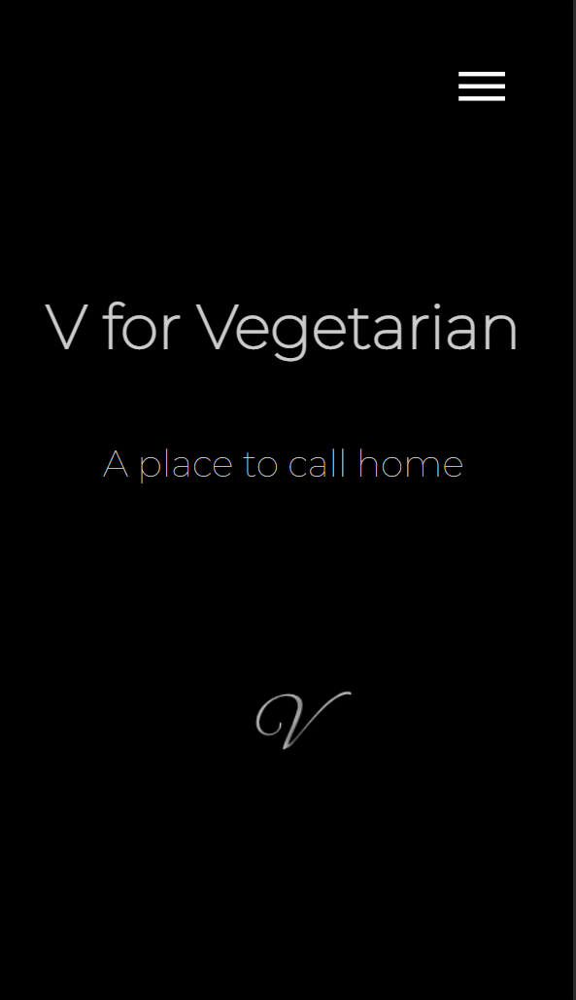

# V for Vegetarian

 Vegetarian restaurant website

# Created By:

Teodora Soffronova

> Note: V for Vegetarian is an imaginary restaurant, every picture, description or information used, is for the sole purpose of creating the project and making it look realistic.

# What is V for Vegetarian?

V for Vegetarian is a modern, minimalistic vegetarian and vegan friendly restaurant.

# Description of the main parts and functionalities of the project

## Desktop version

    It consist of a:

> Home page, greeting the visitors.

> About page with descpription and interior photos.
> Menu page, containing the restaurant's author menu.
> Reservation form, which allows potential visitors to reserve a table for their friends and family.
> Contact page.

## Mobile version

